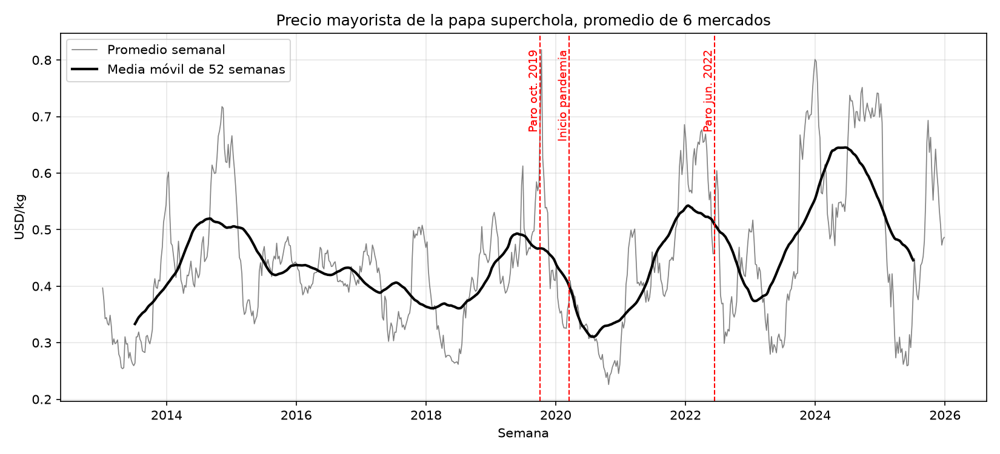
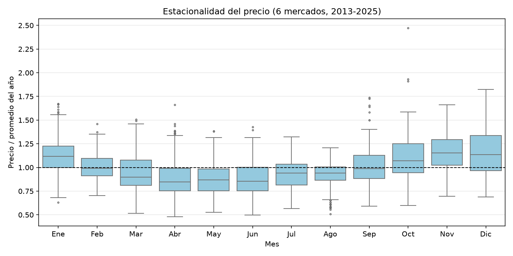
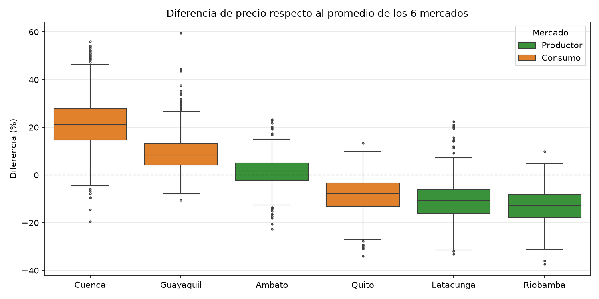
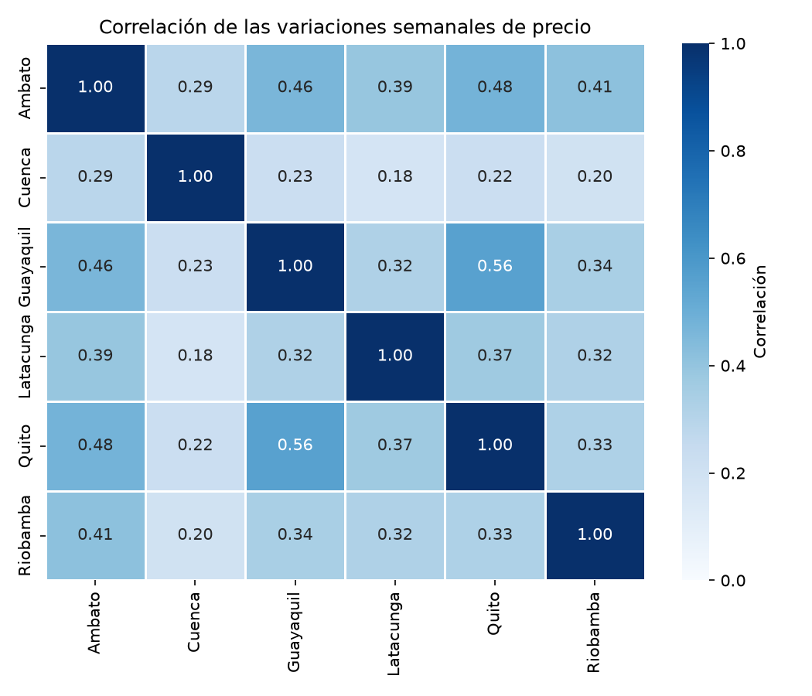
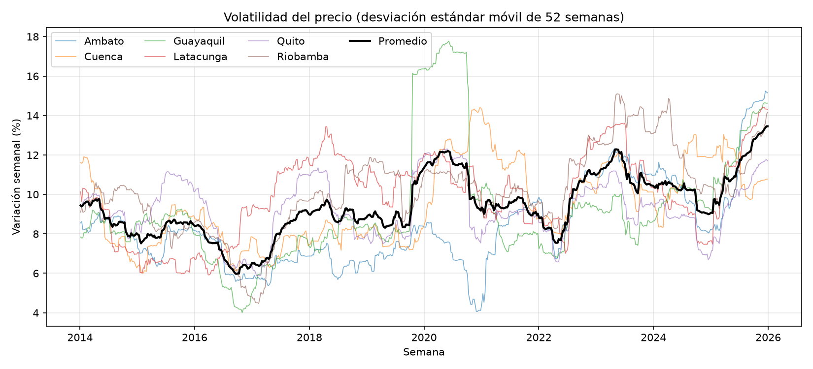

# Papa superchola: precios mayoristas en Ecuador

Adquisición, limpieza, almacenamiento en una db SQLite, análisis exploratorio y visualización de los precios mayoristas de la papa superchola en seis mercados del Ecuador, con datos del Sistema de Información Pública Agropecuaria (SIPA).

Este trabajo corresponde a la fase 1 de un proyecto de Ciencia de Datos. La fase 2 usará estos datos para pronosticar el precio semanal.

## 1. Datos

| Característica | Valor |
|---|---|
| Fuente | SIPA, Ministerio de Agricultura y Ganadería (MAG), módulo *Consulta Personalizada* de precios en mercados mayoristas |
| Parámetros de la consulta | Producto: Papa Súper Chola · Lugar: todos los mercados · Fechas: 01/01/2012 – 31/08/2026 |
| Fecha de descarga | 29/09/2026 |
| Contenido | Precio mayorista registrado en los días de feria de cada mercado |
| Periodo | 02/01/2012 – 28/08/2026 |
| Registros | 17,012 originales - 10,643 tras la limpieza - 4,068 en el panel semanal |
| Archivo original | `Rep_Pre_Prod_X_MercCGINA.csv` (4.06 MB) |

Cada fila del dataset es un precio registrado en un mercado en un día. Los mercados registran entre 2 y 4 precios por semana, en días distintos.

El CSV original viene en codificación UTF-16. La codificación es la regla con la que un archivo guarda cada carácter como bytes. UTF-16 usa 2 bytes por carácter, sin embargo pandas lee por defecto en UTF-8, ya que es la codificación mas común, así que si no se le indica otra al momento de leer el archivo da error o muestra caracteres ilegibles. Por eso el archivo se lee con encoding="utf-16". El original no se convierte ya que la copia en Parquet ya no depende de esa codificación.

**Elección del producto.** Se revisó la cobertura de los productos disponibles en el SIPA. La papa superchola es el producto con más mercados (19) y con series completas en los mercados de Quito, Guayaquil y Cuenca. También se consideró el banano, pero tiene solo 7 mercados y casi no presenta estacionalidad.

## 2. Estructura del repositorio

```
├── data/
│   ├── raw/          # CSV original, solo lectura
│   ├── interim/      # copia de trabajo en .parquet
│   └── processed/    # db SQLite con los datos limpios y el panel semanal
├── scripts/
│   ├── 00_adquisicion.py          # lee el CSV original y crea la copia de trabajo
│   ├── 01_limpieza.py             # limpieza y carga en la db
│   ├── 02_agregacion_semanal.py   # panel mercado x semana
│   ├── 03_eda.py                  # análisis exploratorio
│   └── 04_visualizacion.py        # genera las gráficas
├── reports/
│   └── figures/                   # gráficas en .png
├── requirements.txt
└── README.md
```

En este caso el CSV original sí se sube al repositorio debido a que se descarga a mano desde el SIPA y no se puede obtener con un script.

## 3. Ejecución

Los scripts se ejecutan en orden desde el directorio raíz del proyecto:

```bash
pip install -r requirements.txt
python scripts/00_adquisicion.py
python scripts/01_limpieza.py
python scripts/02_agregacion_semanal.py
python scripts/03_eda.py
python scripts/04_visualizacion.py
```

Las dependencias son: pandas, numpy, pyarrow (para leer y guardar Parquet), matplotlib y seaborn. La db se maneja con `sqlite3` que viene incluido en Python.

## 4. Proceso

```
CSV original  →  copia .parquet  →  limpieza  →  db SQLite  →  panel semanal  →  EDA y gráficas
   (raw)           (interim)                     (processed)    (processed)
```

1. **Adquisición** 
`00_adquisicion.py` lee el CSV indicando su codificación (UTF-16) y la coma decimal, y da nombres descriptivos a las columnas. Luego guarda una copia en Parquet para conservar los tipos de datos.
2. **Limpieza** 
`01_limpieza.py` aplica los criterios de limpieza y guarda el resultado en la db `precios_papa.db`, en una tabla `precios`.
3. **Agregación semanal** 
`02_agregacion_semanal.py` calcula el precio promedio de cada mercado por semana y guarda la tabla `panel_semanal` en la misma db.
4. **EDA** 
`03_eda.py` lee el panel desde la db, genera la metadata y describe cada campo.
5. **Gráficas** 
`04_visualizacion.py` genera una gráfica por pregunta con Matplotlib y Seaborn.

## 5. Parte 1: Limpieza de datos

El objetivo es obtener series de precio comparables en el tiempo y entre mercados. Un mismo producto en una misma presentación en mercados con registros ininterrumpidos. Se aplica un criterio de limpieza solo si afecta el objetivo planteado.

| # | Criterio | Filas eliminadas | ¿Por qué? |
|---|---|---:|---|
| 1 | Duplicados exactos | 0 | Se verificó que no existen. |
| 2 | Presentaciones en saco (120, 140 y 150 lb) | 1,862 | El quintal de 100 lb representa el 89% de los registros. En Cuenca el saco de 140 lb cuesta alrededor de 15% mas por kg que el quintal. |
| 3 | Mercados fuera del alcance | 4,507 | Se trabaja con los 6 mercados con series continuas en 2012-2026. |

**Resultado:** 17,012 - 10,643 filas.

**Mercados seleccionados**

| Mercado | Función | Registros |
|---|---|---:|
| Quito (MMQ-EP) | Consumo | 1,429 |
| Guayaquil (TTV) | Consumo | 1,926 |
| Cuenca (El Arenal) | Consumo | 1,398 |
| Ambato (EP-EMA) | Zona productora | 2,292 |
| Riobamba (EP-EMMPA) | Zona productora | 2,269 |
| Latacunga | Zona productora | 1,329 |


- **Precios extremos:** coinciden con eventos reales como el paro nacional de octubre de 2019 (Guayaquil llegó a 1.54 USD/kg) y el de junio de 2022. Son variaciones reales del mercado.

### Agregación semanal

Cada mercado registra precios en días distintos y con distinta frecuencia, así que se calcula el precio promedio por semana en cada mercado.

| Decisión | ¿Por qué? |
|---|---|
| Periodo 2013-2025 | En 2012 hay huecos de hasta 17 semanas seguidas (Guayaquil, de agosto a diciembre). Al trabajar con años completos cada mes aparece el mismo número de veces. |
| Interpolación lineal | En 2013-2025 la racha más larga sin datos es de 4 semanas (Ambato, inicio de la pandemia en 2020). Solo 33 de 4,068 valores (0.81%) son interpolados. |
| Columna `interpolado` | Marca los valores interpolados para poder excluirlos al evaluar los modelos. |

6 mercados × 678 semanas = 4,068 filas

## 6. Parte 2: Análisis exploratorio

El panel se lee desde la db con `pd.read_sql`. SQLite no guarda fechas ni booleanos, así que `semana` e `interpolado` se restauran a su tipo al leer.

### Metadata por campo

| Campo | Tipo | Nulos (%) | Valores únicos |
|---|---|---:|---:|
| semana | fecha | 0 | 678 semanas |
| mercado | texto | 0 | 6 mercados |
| precio_kg | decimal | 0 | 864 |
| interpolado | booleano | 0 | 2 |

### Precio por mercado (USD/kg, 2013-2025)

| Mercado | Media | Mediana | Mín | Máx | Coef. de variación |
|---|---:|---:|---:|---:|---:|
| Cuenca | 0.534 | 0.529 | 0.243 | 0.992 | 0.252 |
| Guayaquil | 0.484 | 0.470 | 0.240 | 1.304 | 0.287 |
| Ambato | 0.450 | 0.441 | 0.225 | 0.841 | 0.287 |
| Quito | 0.410 | 0.397 | 0.198 | 0.889 | 0.311 |
| Latacunga | 0.396 | 0.375 | 0.198 | 0.757 | 0.303 |
| Riobamba | 0.386 | 0.365 | 0.186 | 0.750 | 0.306 |

Quito es un mercado de consumo, pero su precio es menor que el de Ambato y cercano al de Riobamba y Latacunga. Esto llevó a reformular la pregunta 3.

**Ciclo entre años:** los seis mercados suben y bajan en los mismos años. 2024 tiene el precio más alto (0.64 USD/kg en promedio) y 2020 el más bajo (0.32).

## 7. Parte 3: Visualización

Se generan cinco gráficas, una por pregunta:

| Figura | Técnica | Opción avanzada |
|---|---|---|
| 01 | Serie temporal | Media móvil de 52 semanas y eventos anotados |
| 02 | Diagrama de cajas | Precio relativo al promedio de su año, para separar la estacionalidad del ciclo entre años |
| 03 | Diagrama de cajas | Color según la función del mercado y orden por mediana |
| 04 | Mapa de calor | Correlación de las variaciones semanales, no de los precios |
| 05 | Serie temporal | Desviación estándar móvil por mercado y promedio |

### Pregunta 1: ¿Cómo ha evolucionado el precio entre 2013 y 2025?



**Respuesta**

- El precio oscila entre 0.32 USD/kg (promedio de 2020) y 0.64 (2024), sin una tendencia sostenida de subida o bajada.
- La media móvil muestra ciclos de 2 a 3 años, con máximos en 2014, 2019, 2022 y 2024.
- Tras el inicio de la pandemia el precio cayó al mínimo del periodo, a mediados de 2020.
- El ciclo es compatible con la respuesta de los productores al precio: siembran más cuando el precio es alto, y la mayor oferta lo hace bajar.

### Pregunta 2: ¿Existe un patrón estacional?



**Respuesta**

- Sí. El precio es más bajo de abril a junio, alrededor de 15% bajo el promedio del año.
- Es más alto de noviembre a enero, entre 12% y 15% sobre el promedio.
- El patrón se repite en los seis mercados.
- Cada precio se divide para el promedio de su año para poder comparar un año caro (2024) con uno barato (2026) en la misma escala, 1.10 significa 10% sobre el promedio de ese año.

### Pregunta 3: ¿Qué determina la diferencia de precio entre mercados?



**Respuesta**

- Tomando como referencia el promedio de los 6 mercados, Cuenca está 21% sobre el promedio y Guayaquil 8%, mientras que Riobamba está 13% por debajo.
- Quito está 8% bajo el promedio, al nivel de los mercados productores.
- Los dos mercados más caros son los más alejados de la zona productora de la Sierra centro. La ubicación parece explicar la diferencia mejor que la función del mercado.

### Pregunta 4: ¿Los precios de los mercados se mueven juntos de una semana a otra? ¿Un cambio de precio en un mercado se repite después en otro?



**Respuesta**

- La correlación media entre los precios es de 0.91, pero entre las variaciones semanales es de solo 0.34. La primera es alta porque todos los precios comparten el mismo ciclo de años; la segunda mide si los mercados suben o bajan juntos en la misma semana.
- Quito y Guayaquil son los que más se mueven juntos (0.56). Cuenca es el que menos se mueve con los demás (0.18 a 0.29).
- Se comparó la variación de Quito con la de los otros mercados 1 a 3 semanas antes. La correlación es prácticamente nula. Los cambios ocurren en la misma semana.

### Pregunta 5: ¿Qué tan volátil es el precio y ha cambiado en el tiempo?



**Respuesta**

- La variación semanal típica pasó de 7-9% (2014-2019) a 10-11.5% (2020-2025): la volatilidad aumentó alrededor de un tercio.
- Cuenca es el mercado más estable (coeficiente de variación 0.25).
- El salto de Guayaquil en octubre de 2019 dura exactamente 52 semanas, es el efecto del paro.

## 8. Evolución de las preguntas

Las preguntas se definieron antes de la limpieza, pero el análisis exploratorio nos obligó a modificar una de ellas.

**Pregunta 3**

| | |
|---|---|
| Pregunta original | ¿Los mercados de consumo pagan más que los productores? |
| Qué se observó | En el EDA el precio medio de Quito (0.410 USD/kg) resultó menor que el de Ambato (0.450) y cercano al de Riobamba (0.386) y Latacunga (0.396). Cuenca y Guayaquil sí eran los más caros, pero la clasificación consumo/productor no parecía definir los precios. |
| Nueva pregunta | ¿Qué determina la diferencia de precio entre mercados: su función (consumo o producción) o su ubicación? |


## 9. Limitaciones

- El CSV se descarga a mano desde el SIPA así que una nueva descarga podría diferir si el SIPA corrige registros.
- El dataset solo tiene precios, no incluye volúmenes vendidos ni variables como clima o costos de producción.
- Con seis mercados no se puede separar el efecto de la ubicación y el de la función del mercado.